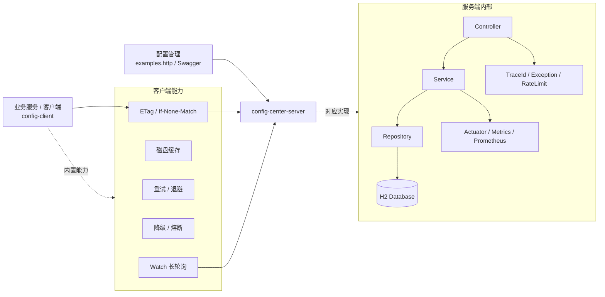
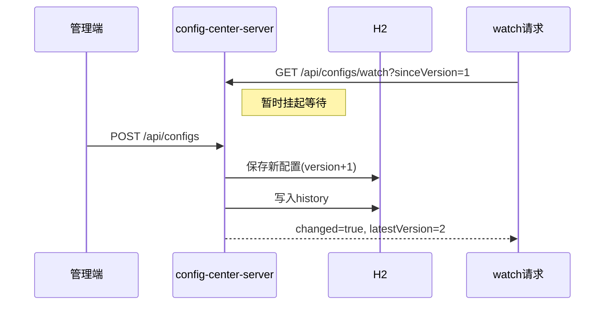
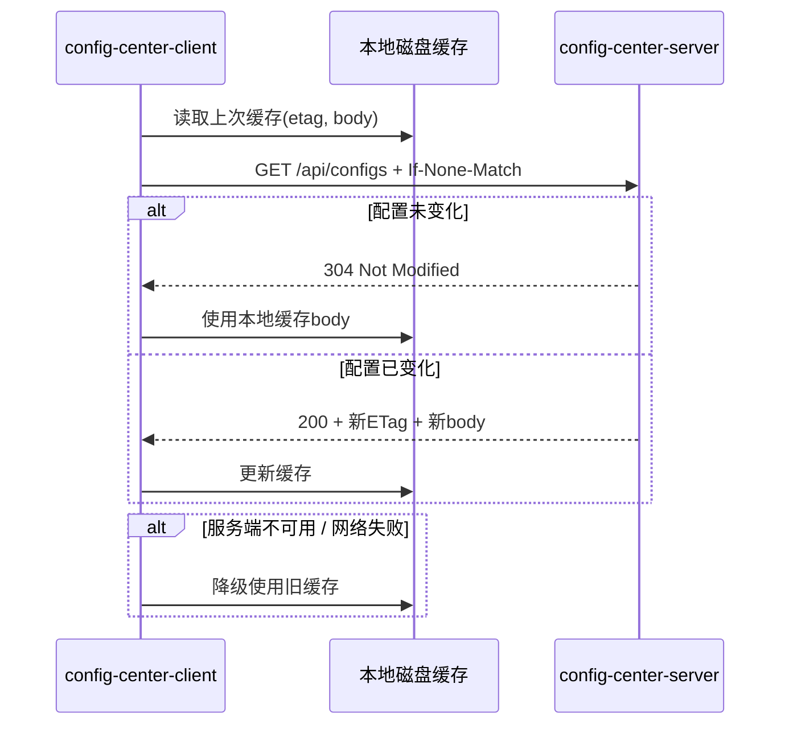

# config-center轻量级配置中心与特性开关平台
[](https://github.com/MyKr-YSteinsK/config-center/actions/workflows/ci.yml)

> 一个基于 **Java 17 + Spring Boot 3 + Maven** 实现的轻量级配置中心与 Feature Flag 平台。

>我做这个项目，一方面是想补足自己在 Spring Boot 工程实践上的能力，另一方面也想在未来研究并行与分布式方向上做初步的探索和尝试，做一些更接近真实后端系统的机制，比如缓存、长轮询、限流、重试和降级。

> 以做完整可运行项目为核心驱动力，借助AI大模型辅助学习理解分布式系统

---

## 1. 项目简介

这个项目主要解决两个问题：

1. **配置中心（Config Center）**  
   把原本散落在代码、配置文件里的参数集中管理，比如数据库连接池大小、功能参数、开关阈值等。

2. **特性开关（Feature Flags）**  
   在不重新发布代码的情况下控制功能是否开启，并支持**白名单**和**灰度发布**。

我做这个项目时，除了把基本 CRUD 跑通，更想把它做成一个涵盖基本完整功能的项目。所以后面重点补的是：

- 版本号与并发安全
- 历史记录与回滚
- 长轮询配置监听
- ETag / 304 条件请求
- 客户端本地缓存与降级
- 超时、重试、指数退避、抖动
- 服务端限流与基础熔断思路
- Actuator / Metrics / Prometheus
- API Key 权限控制

所以它已经不只是一个“能增删改查的demo级别项目”，而基是个**轻量级配置平台**。

---

## 2. 项目亮点

我认为这个项目最有价值的地方有这几个：

- **配置项支持版本号、自增更新、历史审计、回滚**
- **Feature Flag 支持白名单 + 灰度哈希 + 稳定分桶**
- **客户端不是傻轮询，而是支持 ETag / 304、本地磁盘缓存、长轮询监听**
- **在服务端过载或网络抖动时，客户端可以靠旧缓存继续工作**
- **统一返回结构 + traceId + actuator + metrics**，可定位、可观测
- **引入 API Key 的最小权限控制**，让这个系统更像真实生产环境里的基础设施

一句话概括：

> 这是一个强调“配置变更治理 + 客户端可靠拉取 + 分布式环境下稳定性”的轻量级配置中心项目。

---

## 3. 技术栈

### 服务端
- Java 17
- Spring Boot 3.x
- Spring Web
- Spring Data JPA
- H2 内嵌数据库
- springdoc-openapi（Swagger UI）
- Spring Boot Actuator
- Micrometer + Prometheus Registry

### 客户端
- Java 17
- Spring Boot（CLI 模式，不启动 Web Server）
- 自定义 HTTP 拉取逻辑
- 本地磁盘缓存
- 超时 / 重试 / 指数退避 / 抖动

### 工程化
- Maven 多模块
- Git / GitHub
- GitHub Actions（CI）
- JaCoCo 覆盖率报告

---

## 4. 当前功能清单

### 4.1 配置中心
- 按 `app + env + key` 管理配置
- 同一配置项支持**创建 / 更新（upsert）**
- 更新时 `version` 自动递增
- 支持查询单个配置、查询某个应用某个环境下的全部配置
- 支持配置历史查询
- 支持回滚到指定历史版本
- 支持长轮询监听配置变化（watch）
- 支持 ETag / If-None-Match / 304

### 4.2 Feature Flags
- 按 `app + env + name` 管理特性开关
- 支持总开关 `enabled`
- 支持白名单 `allowlist`
- 支持灰度百分比 `rolloutPercentage`
- 评估逻辑采用**稳定哈希 + 分桶**，保证同一用户结果稳定
- 支持历史查询
- 支持回滚到指定版本
- 支持版本冲突检测（`expectedVersion`）

### 4.3 可靠性相关
- 统一返回结构：`code / message / data / traceId`
- 全局异常处理
- 参数校验
- 客户端本地缓存
- 超时控制
- 重试（指数退避 + 抖动）
- 服务端基础限流（429）
- 客户端基础熔断思路
- 服务端挂掉时客户端降级为使用本地缓存

### 4.4 可观测性
- `X-Trace-Id` + 日志 traceId
- `/actuator/health`
- `/actuator/metrics`
- `/actuator/prometheus`
- 自定义限流指标

### 4.5 安全
- 写接口接入最小 API Key 权限校验
- API Key 与 `app / env` 绑定

---

## 5. 项目结构

```text
config-center/
├── pom.xml                              # parent pom，多模块聚合
├── README.md
├── examples.http                        # 接口调试脚本
├── .github/
│   └── workflows/
│       └── ci.yml                       # GitHub Actions
├── config-center-server/
│   ├── pom.xml
│   └── src/
│       ├── main/
│       │   ├── java/com/example/configcenter/
│       │   │   ├── config/             # traceId、配置绑定等
│       │   │   ├── controller/         # Config / Feature / Watch 等接口
│       │   │   ├── domain/
│       │   │   │   ├── entity/         # ConfigItem / FeatureFlag / History
│       │   │   │   └── converter/      # List<String> <-> JSON
│       │   │   ├── dto/                # 请求/响应对象
│       │   │   ├── exception/          # 错误码与全局异常处理
│       │   │   ├── metrics/            # 自定义指标
│       │   │   ├── repository/         # JPA Repository
│       │   │   ├── service/            # 核心业务逻辑
│       │   │   └── web/                # 限流、Web 配置
│       │   └── resources/
│       │       └── application.yml
│       └── test/
└── config-center-client/
    ├── pom.xml
    └── src/
        ├── main/java/com/example/democlient/
        │   ├── DemoClientApplication.java
        │   ├── DemoRunner.java
        │   ├── HttpDiskCache.java
        │   ├── ReliableHttp.java
        │   ├── RetryPolicy.java
        │   └── CircuitBreaker.java
        └── resources/
            └── application.yml

```

---

## 6. 系统架构图

### 6.1 总体架构



### 6.2 配置更新与监听流程



### 6.3 客户端拉取流程



---

## 7. 关键机制说明

### 7.1 为什么配置项和 Feature 都要有 `version`
下面这些功能都依赖`version`：
- 历史记录
- 回滚
- ETag 计算
- 长轮询 sinceVersion
- 并发更新冲突检测

即`version` 贯穿整个配置治理链路。

---

### 7.2 Feature 灰度为什么要用稳定哈希
Feature 评估不是简单随机数，而是：

```text
hash(userId + ":" + featureName) % 100
```

这样做的好处是：

- 同一个用户多次访问结果稳定
- 不同功能的分桶相互独立
- 可以用 `rolloutPercentage` 实现稳定灰度

评估顺序是：

1. `enabled = false` → 直接 false
2. 在 allowlist 中 → 直接 true
3. 否则走灰度分桶

---

### 7.3 为什么要做历史与回滚
配置系统里最可怕的问题是：

> 改错了之后，不能快速恢复。

所以这里的回滚实现是：

> 读取目标历史版本的快照，再写成一个新的当前版本。

这样做的好处是历史链条不会断，审计更清楚。

---

### 7.4 为什么客户端要做 ETag / 本地缓存 / 降级
如果每次都全量拉配置：

- 浪费带宽
- 拉取延迟高
- 服务端压力大
- 服务端临时挂了客户端会直接受影响

所以这里用了三层保护：

1. **ETag / 304**：配置没变就不传 body
2. **磁盘缓存**：客户端重启后还能直接用旧配置
3. **降级**：服务端故障时，优先用本地缓存继续跑

> 保证能拿新配置最好，拿不到的情况下也不会把业务一起弄崩。

---

### 7.5 为什么 watch 用长轮询而不是 WebSocket
这个项目里我选择了 **long polling**，没有直接上 WebSocket，原因是：

- 实现更简单
- 更适合“配置更新频率不高”的场景
- 接近很多配置中心实际采用的思路
- 也更容易和 HTTP、鉴权、网关兼容

---

### 7.6 为什么要做限流、重试、退避、熔断
分布式系统里为了避免这两种情况：

1. 服务端已经很忙，客户端还在疯狂重试
2. 客户端把瞬时故障放大成雪崩

所以这里引入了：

- 服务端基础限流（429）
- 客户端超时控制
- 指数退避 + 抖动
- 降级到本地缓存
- 基础断路器思路

> 网络和服务在出问题的时候，让系统带着故障继续工作。

---

## 8. 快速开始

### 8.1 环境要求
- JDK 17
- Maven 3.8+
- IntelliJ IDEA（推荐）

### 8.2 拉起项目
在根目录执行：

```bash
mvn -q clean verify
```

启动服务端：

```bash
mvn -pl config-center-server spring-boot:run
```

启动客户端：

```bash
mvn -pl demo-client spring-boot:run
```

---

## 9. 访问地址

### Swagger
```text
http://localhost:8080/swagger-ui/index.html
```

### H2 Console
```text
http://localhost:8080/h2-console
```

H2 连接信息：

- JDBC URL: `jdbc:h2:mem:configdb`
- username: `sa`
- password: 空

### Actuator
```text
http://localhost:8080/actuator/health
http://localhost:8080/actuator/metrics
http://localhost:8080/actuator/prometheus
```

---

## 10. 接口一览

### 配置中心
- `POST /api/configs`：创建或更新配置
- `GET /api/configs?app=...&env=...`：查询全部配置
- `GET /api/configs/{key}?app=...&env=...`：查询单个配置
- `GET /api/configs/history?app=...&env=...&key=...`：查询配置历史
- `POST /api/configs/rollback`：回滚配置
- `GET /api/configs/watch?app=...&env=...&sinceVersion=...&timeoutSeconds=...`：监听配置变化

### Feature Flags
- `POST /api/features`：创建或更新特性开关
- `GET /api/features?app=...&env=...`：查询全部开关
- `GET /api/features/evaluate?app=...&env=...&name=...&userId=...`：评估功能是否开启
- `GET /api/features/history?app=...&env=...&name=...`：查询历史
- `POST /api/features/rollback`：回滚特性开关

---


## 11. config-center-client 说明

`config-center-client` 是一个命令行客户端，用来模拟“真实业务服务如何拉配置、评估功能开关”。

它目前具备：

- 按 `app/env` 拉取配置
- 使用 ETag 做条件请求
- 把配置缓存到本地文件
- 重启后仍然可以复用缓存
- 网络失败时降级到旧缓存
- 支持长轮询 watch 配置变化（基础版本）
- 对 Feature 评估结果进行打印

### 运行方式

```bash
mvn -pl demo-client spring-boot:run
```

### 本地缓存文件
Windows 下一般会写到：

```text
C:\Users\<你的用户名>\.config-center-client-cache.json
```

### 典型输出
```text
=== Demo Client ===

Fetching configs...
200 OK -> cache etag=W/"..."
...

Fetching configs...
304 Not Modified -> use cached body
...
```

---

## 12. examples.http / curl 示例

具体示例请参考[examples.http](./examples.http)

---

## 13. 我在这个项目里重点做了哪些设计取舍

### 13.1 为什么数据库用 H2
因为这个项目重点在**机制实现**，不是部署平台本身。H2 让项目开箱即跑，适合用于快速构建。  
后续完全可以切到 MySQL / PostgreSQL。

### 13.2 为什么 allowlist 不拆表
当前用 `List<String> -> JSON` 存储，是为了把重点放在：

- 评估逻辑
- 分层设计
- 回滚 / 历史 / 灰度机制

如果一开始就拆表，工程会更复杂，但不会显著提高项目表达效果。

### 13.3 为什么客户端做磁盘缓存
因为 config-center-client 是 CLI 程序，每次运行都会退出。  
如果只做内存缓存，第二次启动就没有数据。  
所以磁盘缓存更适合演示 ETag / 304 / 降级。

### 13.4 为什么权限控制先做最小版本
目前先对写配置接口加了 API Key，是因为这个系统最敏感的是“谁能改配置”。  
更完整的版本可以继续扩展到：

- Feature 写接口鉴权
- 读接口鉴权
- 角色模型（RBAC）
- 多租户隔离

---

## 14. 未来计划（后续准备继续扩展的方向）

我还计划继续往下面几个方向扩展：

### 14.1 数据库与部署
- 切换到 MySQL / PostgreSQL
- 引入 Flyway 做数据库迁移
- 用 Docker Compose 一键启动依赖

### 14.2 安全能力
- API Key 扩展到 Feature 写接口
- 细化 app/env 级别权限控制
- 后续尝试 RBAC 或 JWT

### 14.3 配置下发
- 在当前 long polling 基础上继续尝试 SSE / WebSocket
- 补充 Feature Watch 机制
- 做客户端本地定时刷新与 watch 结合

### 14.4 可观测性
- 接入 Prometheus + Grafana
- 增加更细的业务指标（缓存命中率、回滚次数、watch 唤醒次数）
- 增加 dashboard 截图或导出 JSON

---

