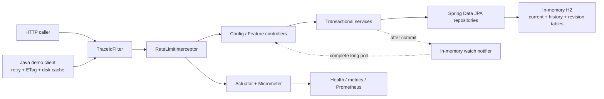

# config-center

`config-center` is a lightweight configuration center and Feature Flag learning project built with Java 17, Spring Boot 3, Spring Data JPA, H2, and a Maven multi-module layout.

The repository currently provides a verified local baseline for configuration versioning, rollback, conditional HTTP reads, long polling, Feature Flag evaluation, and a resilient Java demo client. It is intentionally smaller than a production control plane.

## Verified capabilities

- Configuration CRUD-style upsert and reads by `app + env + key`
- Append-only configuration history and rollback as a new business version
- Feature Flag upsert, history, rollback, allowlist, and stable percentage rollout
- `ETag` / `If-None-Match` configuration reads with HTTP 304
- Long-poll configuration watch based on a persistent `app + env` namespace revision
- API Key authorization for configuration upsert and rollback
- Optimistic-lock conflict handling and consistent HTTP error statuses
- Java CLI client with retry, circuit breaking, ETag cache, transient-failure fallback, and watch refresh
- Trace IDs, rate limiting, Actuator, Micrometer/Prometheus, JaCoCo, and CI verification

## Architecture


```mermaid
flowchart LR
    Caller["HTTP caller"] --> Trace["TraceIdFilter"]
    Demo["Java demo client\nretry + ETag + disk cache"] --> Trace
    Trace --> Rate["RateLimitInterceptor"]
    Rate --> Controllers["Config / Feature controllers"]
    Controllers --> Services["Transactional services"]
    Services --> Repositories["Spring Data JPA repositories"]
    Repositories --> H2["In-memory H2\ncurrent + history + revision tables"]
    Services -. "after commit" .-> Watch["In-memory watch notifier"]
    Watch -. "complete long poll" .-> Controllers
    Metrics["Actuator + Micrometer"] --> Registry["Health / metrics / Prometheus"]
    Rate --> Metrics
```

## Prerequisites and build

- JDK 17
- Internet access on the first wrapper run so Maven 3.9.16 can be downloaded

Windows PowerShell:

```powershell
.\mvnw.cmd -q -B clean verify
```

Unix-like shell:

```bash
./mvnw -q -B clean verify
```

The build runs both modules' tests and generates JaCoCo reports under:

- `config-center-server/target/site/jacoco/index.html`
- `config-center-client/target/site/jacoco/index.html`

## Run the server

After the build, start the executable server jar:

```powershell
java -jar config-center-server/target/config-center-server-1.0.0.jar
```

For the deterministic request sequence below, disable only the local rate limiter while keeping all application behavior under demonstration:

```powershell
java -jar config-center-server/target/config-center-server-1.0.0.jar --rate-limit.enabled=false
```

The default port is `8080`. Important local endpoints:

- Swagger UI: `http://localhost:8080/swagger-ui/index.html`
- H2 Console: `http://localhost:8080/h2-console`
- Health: `http://localhost:8080/actuator/health`
- Metrics: `http://localhost:8080/actuator/metrics`
- Prometheus: `http://localhost:8080/actuator/prometheus`

## Verified local demonstration

The following PowerShell sequence assumes a freshly started server using the deterministic command above. The default development API Key authorizes configuration writes only for `demo-app/dev`.

```powershell
$base = "http://localhost:8080"
$writeHeaders = @{ "X-API-Key" = "kr-dev-key" }

$configBody = @{
  app = "demo-app"
  env = "dev"
  key = "db.pool.size"
  value = "10"
  description = "pool size"
  operator = "demo"
  reason = "local verification"
} | ConvertTo-Json

$config = Invoke-RestMethod -Method Post `
  -Uri "$base/api/configs" `
  -Headers $writeHeaders `
  -ContentType "application/json" `
  -Body $configBody

$list = Invoke-WebRequest -Uri "$base/api/configs?app=demo-app&env=dev"
$etag = $list.Headers["ETag"]
try {
  $notModified = (Invoke-WebRequest `
    -Uri "$base/api/configs?app=demo-app&env=dev" `
    -Headers @{ "If-None-Match" = $etag }).StatusCode
} catch {
  $notModified = [int]$_.Exception.Response.StatusCode
}

$featureBody = @{
  app = "demo-app"
  env = "dev"
  name = "new-checkout"
  enabled = $true
  rolloutPercentage = 30
  allowlist = @("u1000", "u2000")
  operator = "demo"
  reason = "local verification"
} | ConvertTo-Json

$feature = Invoke-RestMethod -Method Post `
  -Uri "$base/api/features" `
  -ContentType "application/json" `
  -Body $featureBody

$evaluation = Invoke-RestMethod `
  -Uri "$base/api/features/evaluate?app=demo-app&env=dev&name=new-checkout&userId=u1000"
$watch = Invoke-RestMethod `
  -Uri "$base/api/configs/watch?app=demo-app&env=dev&sinceVersion=0&timeoutSeconds=1"

$config.data | Select-Object key, value, version
$notModified
$feature.data | Select-Object name, enabled, version
$evaluation.data | Select-Object userId, enabled, decision
$watch.data | Select-Object changed, latestVersion
```

Expected stable fields from a fresh server:

```text
key=db.pool.size, value=10, version=1
304
name=new-checkout, enabled=True, version=1
userId=u1000, enabled=True, decision=allowlist 命中
changed=True, latestVersion=1
```

`traceId`, timestamps, and the ETag hash are intentionally omitted because they vary by request or data state.

## Run the demo client

After seeding the configuration and Feature Flag above, run the client once without long polling:

```powershell
.\mvnw.cmd -q -B -pl config-center-client spring-boot:run '-Dspring-boot.run.arguments=--demo.watch.enabled=false'
```

Remove the argument to use the configured five long-poll rounds. The client cache is stored at `${user.home}/.config-center-client-cache.json`; an existing legacy `.config-center-demo-client-cache.json` is migrated without being deleted.

## Public API

| Method | Path | Write authorization | Purpose |
| --- | --- | --- | --- |
| `GET` | `/api/ping` | none | Liveness-style application response |
| `POST` | `/api/configs` | `X-API-Key` | Create or update a configuration |
| `GET` | `/api/configs` | none | List configurations; supports `If-None-Match` |
| `GET` | `/api/configs/{key}` | none | Read one configuration |
| `GET` | `/api/configs/history` | none | Read configuration history |
| `POST` | `/api/configs/rollback` | `X-API-Key` | Restore a snapshot as a new version |
| `GET` | `/api/configs/watch` | none | Long-poll a namespace revision |
| `POST` | `/api/features` | none | Create or update a Feature Flag |
| `GET` | `/api/features` | none | List Feature Flags |
| `GET` | `/api/features/evaluate` | none | Evaluate one user |
| `GET` | `/api/features/history` | none | Read Feature Flag history |
| `POST` | `/api/features/rollback` | none | Restore a Feature Flag snapshot as a new version |

All normal JSON responses use `code`, `message`, `data`, and `traceId`. Matching ETag requests return HTTP 304 without a JSON body. See `examples.http` for ready-to-run requests.

Configuration-list data and its weak ETag are generated from one ordered in-memory snapshot. The hash uses an unambiguous length-prefixed encoding of every response item field, so reset business versions cannot hide changed values or descriptions.

## Main configuration

| Setting | Default | Meaning |
| --- | --- | --- |
| `server.port` | `8080` | Server HTTP port |
| `spring.datasource.url` | in-memory H2 | Local persistence; data is lost when the process ends |
| `rate-limit.enabled` | `true` | Enables per-process API rate limiting |
| `rate-limit.capacity` | `5` | Initial token-bucket capacity |
| `rate-limit.refill-per-second` | `5` | Token refill rate |
| `security.api-keys` | one `demo-app/dev` key | Configuration write authorization mappings |
| `demo.http.*` | `800/3000 ms` | Client connect/read timeouts |
| `demo.watch.*` | `10 s + 2000 ms margin`, 5 rounds | Client long-poll settings |

## Known limits

- H2 is in-memory and uses Hibernate `ddl-auto=update`; there is no production database migration path yet.
- The configured API Key is plaintext and intended only for local learning. Feature Flag writes are deliberately unauthenticated in the current scope.
- Rate-limit buckets and long-poll waiters are process-local; multiple server instances do not coordinate them.
- The client is a demonstration CLI, not a published SDK, and its Java package still uses the legacy name `com.example.democlient`.
- The cache is a user-home JSON file without encryption or cross-process locking.
- There is no RBAC, multi-tenancy, frontend administration UI, or distributed deployment support.

## Project documentation

- `docs/project-map.md`: current architecture and behavior
- `docs/dev-plan.md`: completed stabilization phases and deferred ideas
- `docs/patch-log.md`: append-only verification history
- `examples.http`: request examples aligned with current authorization and response behavior
